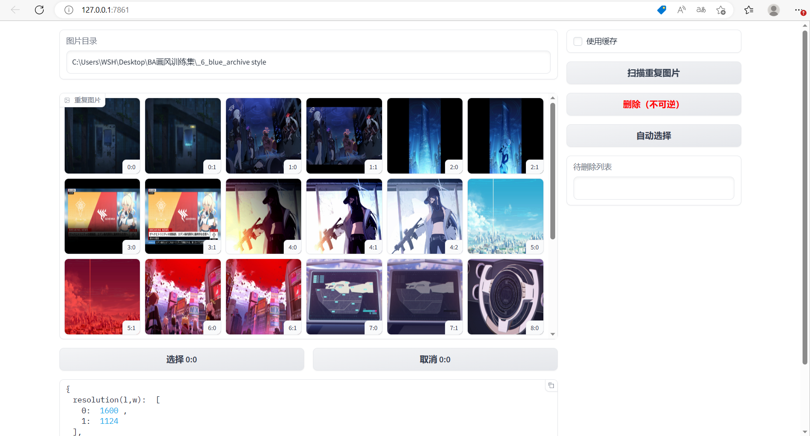
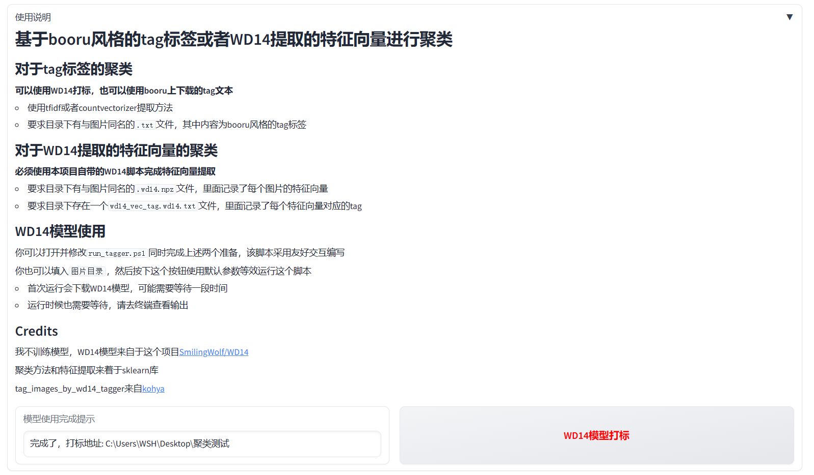
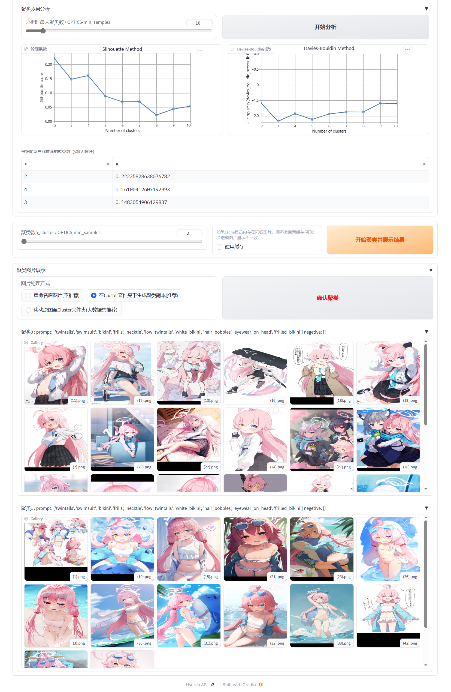
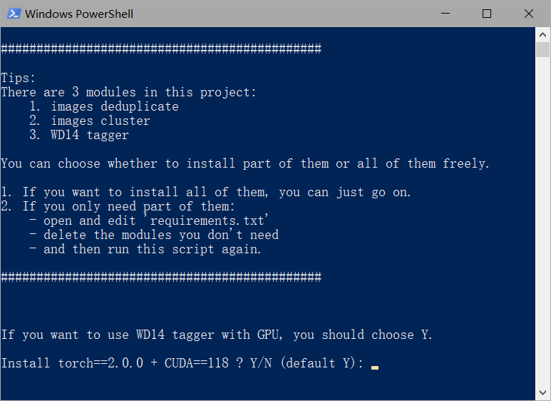
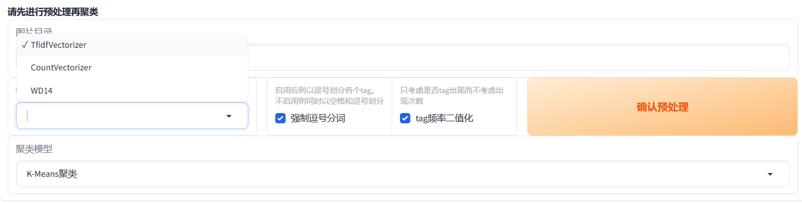
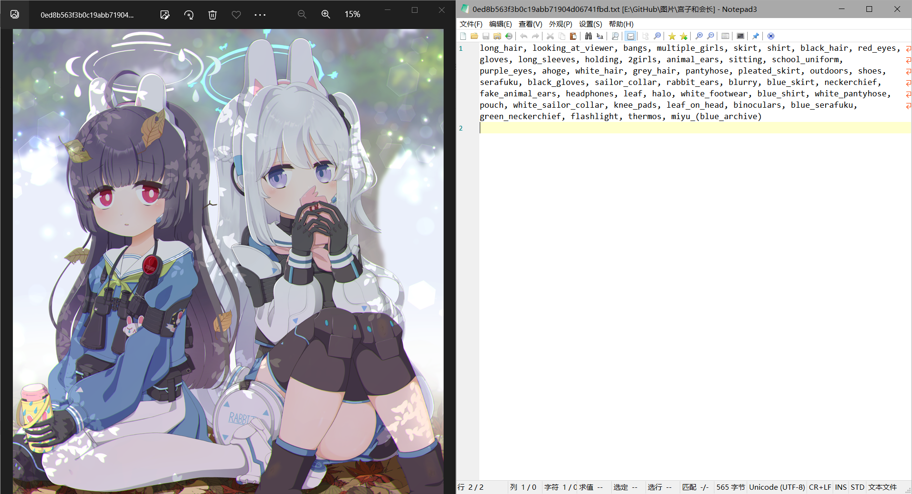
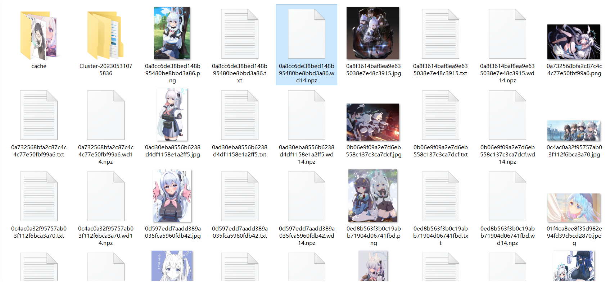
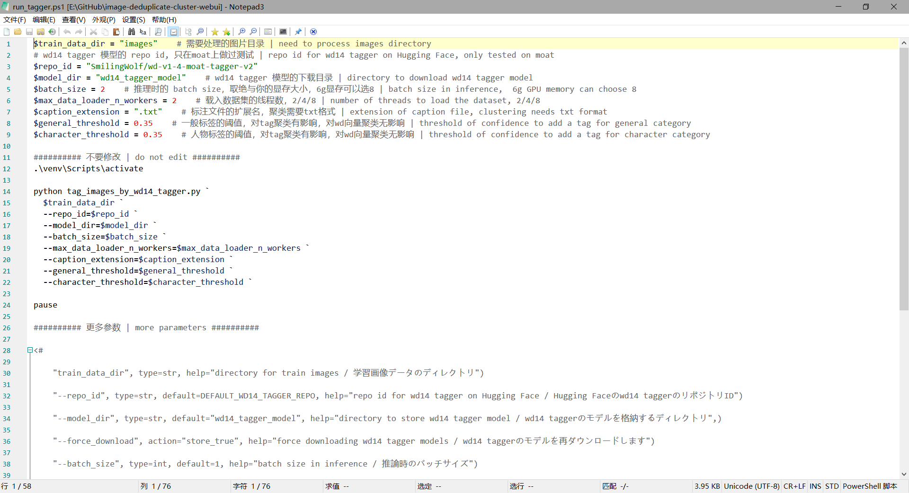

# image-deduplicate-cluster-webui
 A WebUI script that deduplicates images or clusters them by tags.  一个用于图像查重和基于tags聚类的WebUI脚本

## 现在我们有什么？
 - 基于imagededup库，进行图片去重的WebUI
 - 基于sklearn库，以tags为特征，或者以WD14 tagger模型提取的特征向量进行图片聚类WebUI

## 部分展示
### 查重演示

### 聚类演示

**另一张复杂情况的8聚类效果请看[这里](./docs/images_cluster_show_1.png)**

## Credit
 - 我不训练模型，WD14模型来自于这个项目[SmilingWolf/WD14](https://huggingface.co/SmilingWolf)
 - 聚类方法和特征提取来着于sklearn库
 - 查重方法来自于imagededup库
 - tag_images_by_wd14_tagger来自[kohya/sd-scripts](https://github.com/kohya-ss/sd-scripts/blob/main/finetune/tag_images_by_wd14_tagger.py)

## 安装 Install

这个项目被分为三个模块
 - 图像查重
 - 图像聚类
 - WD14 tagger

每个模块所需的依赖已经写在[requirements.txt](requirements.txt)

你可以把你不要的模块从中删去

**一键运行`install.sh`即可**

### 安装Tips
对于WD14 模型的使用，可以进行CPU或者GPU的推理，其中GPU的推理速度快，但是要求cuda环境

运行`install.sh`时会提问你是否需要安装`Torch==2.0.0 + cuda118`

如果你配置过系统级的cuda环境，或者你不需要使用WD14模型的GPU推理，可以选择否

如果你需要进行WD14 tagger的GPU推理，你可以选择Y进行`Torch==2.0.0 + cuda118`的安装，其能够在虚拟环境中配置cuda环境

## 使用Tips

### 图片查重
图片查重不依赖任何tag文本或者WD14模型

一键运行`run_deduplicate_images.ps1`，其将会生成一个WebUI，进行操作即可

### 图片聚类
图片聚类依赖与图片同名的txt文本**或者**npz文件进行聚类，这取决于你在WebUI中选择的特征提取方式

#### 选择tf-idf或者countvectorizer提取特征，则需要txt文本
其中txt内容为与图片对应的booru风格的tag标签，例如
`1girl， solo， yellow eyes`

#### wd14提取特征，则需要npz文件
其中npz文件储存着WD14模型提取的特征向量矩阵,其的生成**必须**使用本项目自带的`tag_images_by_wd14_tagger.py`，或者在聚类WebUI中生成

这是因为聚类采用的是WD14模型的倒数第三层输出，这需要对原作者的模型进行结构调整

### WD14 tagger
本项目自带的WD14 tagger模型来自于[SmilingWolf/WD14](https://huggingface.co/SmilingWolf)，我对其结构进行了调整，增加了后四层的输出，并采取倒数第三层做为特征向量

你可以使用`tag_images_by_wd14_tagger.py`进行图片打标，获取txt文本，这与[toriato/stable-diffusion-webui-wd14-tagger](https://github.com/toriato/stable-diffusion-webui-wd14-tagger)的打标结果并无太大差异

同时其会输出同名的npz文件，其中包含了WD14模型的倒数前四层的输出，你可以在聚类WebUI中使用

**注意，SmilingWolf有很多个WD14 tagger模型，每个模型的结构都不一样，我需要的是norm层的输出结果，这在[wd-v1-4-moat-tagger-v2](https://huggingface.co/SmilingWolf/wd-v1-4-moat-tagger-v2)是倒数第三层，其他模型尚未进行测试**

## Todo

- [ ] 在Colab上部署
- [x] 完成本地部署封装
- [ ] 完成A111-SD-WebUI部署
- [x] 增加WD14提取特征和生成tags文本
	- [x] 使用WD14生成特征向量到npz文件，避免多次聚类时重复运行耗时
	- [ ] 增加释放模型功能
	- [x] 增加使用倒数第三层模型
- 聚类
	- [ ] 为图片聚类增加SVD降维
	- [o] 增加tags文本字符串预处理（如将空格变为逗号）
	  - 已经取消，因为Gelbooru-API-Downloader已经自带了这个功能
	- [ ] 为聚类文件夹增加标签
	- [ ] 修正特征重要性分析的标签错误(应用占比50判断)
	- [ ] 增加手动选择是否应用某个聚类功能
	- [x] 增加更多分析方法
	  - 现在有轮廓系数和Davids系数
	- [x] 更多聚类方式
	  - 现在有kmeans，谱聚类、层次聚类，OPTICS聚类
	  - [ ] 为不同聚类方式增加参数选择功能
	  - [o] 将聚类方法选择独立出来
	    - 暂时取消,因为使用npz文件后，读取特征向量已经很快了
- 查重
	- [x] 为查重添加选择全部选项
	- [ ] 为查重添加更多查重方式和查重阈值
	- [x] 重写查重启发式选择算法
	- [ ] 为查重添加移动图片功能
	- [ ] 为查重删除添加删除tag文本功能

## 寻求帮助

**tensorflow，在gradio中使用wd14无法释放显存**
**现已经用multiprocesing解决了，但是有几个疑惑**

 - 为什么用concurrent.futures.ProcessPoolExecutor创建子进程也无法释放？
   - 会不会是multiprocesing不需要和父进程通信，意味着结束后完全无引用，所以自动释放了
   - 会不会是主进程最开头中导入了tag_images_by_wd14_tagger，造成的显存资源共享，因此WD结束后主进程仍然保存着显存的引用？
 - 如何增加保留模型在显存中以进行快速下一次推理功能
   - **计划使用onnxruntime实现**
 - 考虑是不是torch.tensor的占用问题
   - 基本确定是tensorflow无法释放
 - 为什么tag_images_by_wd14_tagger.main里要再一次import torch
   - 我又把main里的torch删了，问题却没出现？为什么？
 - 考虑删除model和tensor，配合gc.collect()回收
 - 考虑tensorflow的sesson

 **考虑使用onnx加载模型，两个方案**
  - [ ] 先把keras模型下载，调整输出后再本地导出onnx格式
    - **采纳此方案**
    - 在colab中实验时观察到
	  - 对于onnx，似乎用for循环和一次性批量输入相差时间不大
	  - 对于tf，for循环比批量输入要慢的多
	  - 对于批量，tf和onnx似乎时间差不多
  - [x] 直接下载onnx模型，用onnx库来调输出层（似乎层不一样）
    - 已经实现，但仍有问题
	  - 很难使用多进程
	  - 多线程带来的一点提升似乎是在写入文件的IO上，因为GPU已经跑满了，当然也有可能是载入显存能更快进行推算，而减小CPU到GPU的通信
	  - 虽然启动比tensorflow快，但在超大数据集（应该要大于400张）的并发表现不如tf
  - 我把调整好的onnx上传到huggingface

 **考虑使用torch加载模型**
