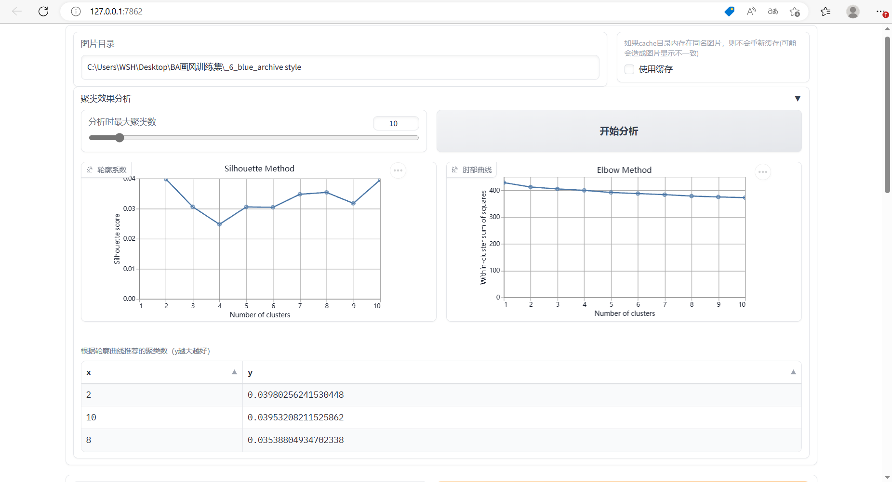
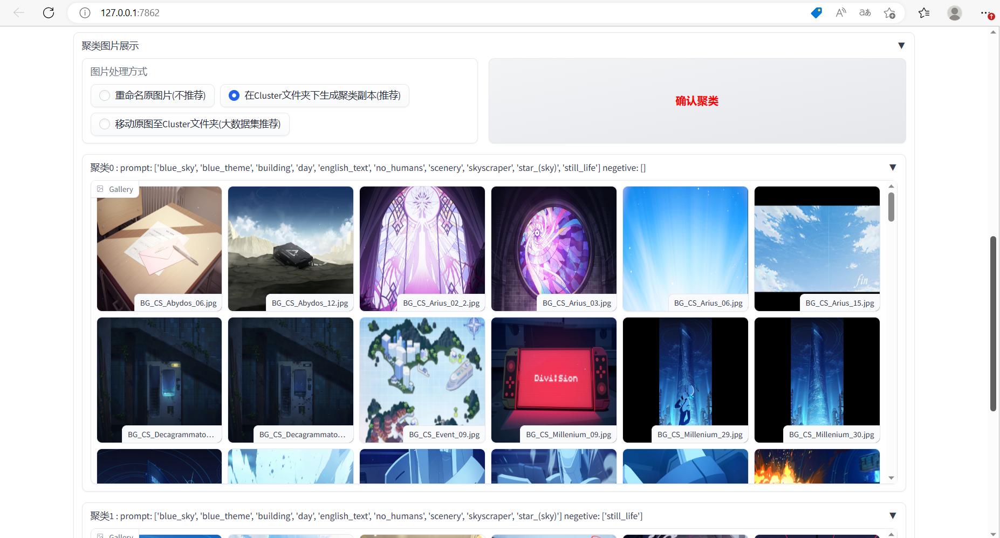

# image-deduplicate-cluster-webui
 A WebUI script that deduplicates images or clusters them by tags.  一个用于图像查重和基于tags聚类的WebUI脚本

## 现在我们有什么？
 - 基于imagededup库，进行图片去重的WebUI
 - 基于sklearn库，以tags为特征的图片聚类WebUI

## Todo
- [ ] 在Colab上部署
- [ ] 完成本地部署封装
- [ ] 完成A111-SD-WebUI部署
- [ ] 为图片聚类增加SVD降维，更多聚类方式与参数
- [ ] 为查重添加选择全部选项，重写启发式选择算法
- [ ] 为查重删除添加删除tag文本功能

## 部分展示

